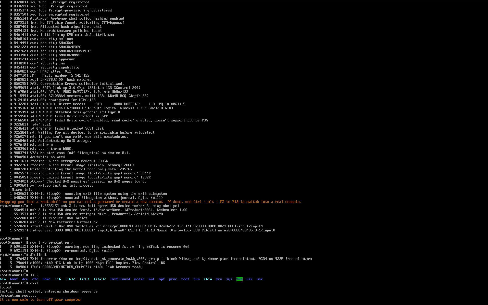

# micro_init
A tiny init binary intended to boot Ubuntu Base from an ext2 .img file on a FAT32 usb flash drive



# What is Ubuntu Base?

Ubuntu Base is a small (27.1 MB) distribution of Ubuntu that is intended to run in chroot containers. It lacks its own init system, which is arguably its main advantage (Ubuntu uses systemd).

It comes with a fully functioning APT, so you can extend it to a full Ubuntu system, granted you have networking connectivity.

Annoyingly, Ubuntu Base lacks the packages required to set up a working network connection. Well, no wonder; it was meant to be run in a container in an environment that already has a connection set up, but that's not what we're doing. We're booting it raw!

- [Download Ubuntu Base](http://cdimage.ubuntu.com/ubuntu-base/releases/21.04/release/)
- [Download `dhclient` and `ip` packages, plus dependencies](https://github.com/AXKuhta/micro_init/releases/download/v0.1/ubuntu_21.04_net_packages.tar)

# List of gotchas

- You _must_ have an empty folder named `dev`
- You _must_ have an empty folder named `newroot`
- You _must_ mount root rw
- Your kernel _must_ have `CONFIG_DEVTMPFS` and `CONFIG_DEVTMPFS_MOUNT` enabled in order to automount `/dev`<br>You know it automounts if you see a line "devtmpfs: mounted" shortly after mounting root<br>Theoretically micro_init could do this by itself... Let implementing this be your homework?
 
Example kernel command line:

```
root=/dev/sda1 rw rootwait init=/micro_init
```
